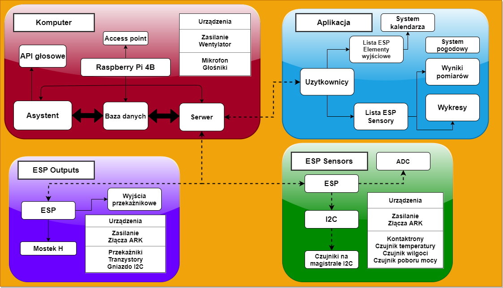
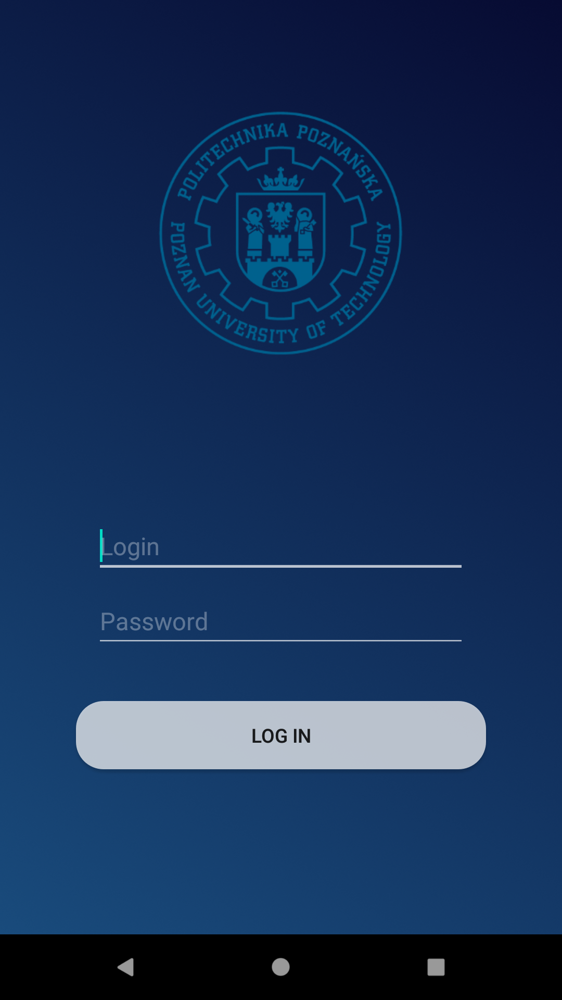
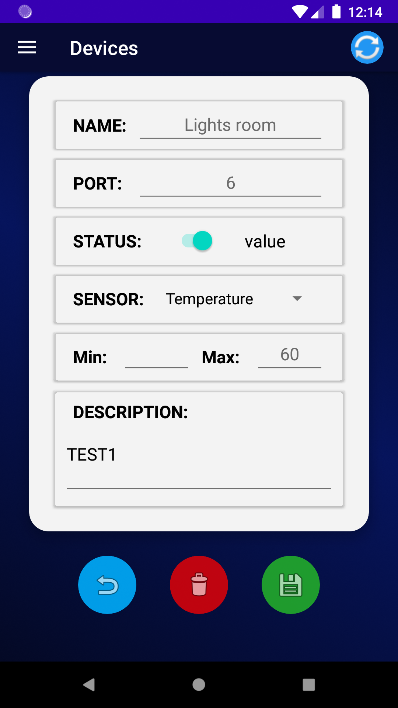

# Projekt, praca dyplomowa pod tytułem "Układ sterowania inteligentnego budynku mieszkalnego "
Projekt został zrealizowany w ramach pracy dyplomowej na uczelni wyższej, Politechniki Poznańskiej. Miała ona na celu opracowania systemu do zarządzania domostwem.

## Założenia aplikacji: 
### Funkcje aplikacji:
   - Opracowanie układu kontroli i sterowania budynkiem mieszkalnym
   - Opracowanie mobilnego interfejsu uzytkownika
   - Opracowanie układu komunikacji głosowej

Aplikacja składa się z 4 elementów: Komputera (asystent Google'a, serwer, baza danych), Aplikacja (interfejs użytkownika), ESP Sensors (pobieranie danych z czujników), ESP Outputs (zarządzanie załączaniem urządzeń).
## Komputer.

Jako komputer został zaimplementowany komputer Raspberry Pi 4B, który posiada w sobie instancje:
#### Serwer.
Został zrealizowany za pomocą frameworku Django oraz Django REST framework. Została stworzona strona administracyjna do szybkiego modelowania informacji w bazie.

### Baza danych.
Ze względu na wykorzystanie systemu operacyjnego Debian została zaimplementowana baza SQL w dystrybucji MariaDB. Baza posiada tablice: Użytkownik, ESP Sensor, ESP Output. Tablice ESP Sensor oraz ESP Output są w relacji Many-to-Many z tablicą Użytkownik.

#### Asystent.
Asystent został zaimplementowany jako gotowe rozwiązanie GassistPI[www] https://gassistpi-documentation.readthedocs.io. Wymieniony SDK korzysta z rozwiązań Asystenta Google'a. Zostały również dodane skrypty do sterowania płytką ESP Outputs. 

### Płytki PCB.
Zaprojektowano dwa typy płytek w programie Eagle, które są uniwersalne i mają możliwość podłączenia różnych urządzeń. Napięcie zasilające może osiągać wartość od 10 do 20 Voltów DC. 
#### ESP Sensors
Zawiera:
- 4 porty ADC (2x port z 5V, 2x port 3V3),
- 5 portów kontaktronów, badanie statusu pinów czy zostały zwarte czy rozwarte.
- 4 porty magistrali I2C (2x port z 5V, 2x port 3V3).

#### ESP Outputs
- 5 portów przekaźnikowych zasilonych napięciem zasilania. 
- 2 porty do sterowania silnikiem DC.

### Aplikacja
Składa się ona z dwóch aktywności: uwierzytelnienie użytkownika oraz zarządzanie urządzeniami i sensorami w sieci. Zaimplementowano wykresy wartości czujników. Aplikacja współpracuje ściśle z serwerem i komunikuje się z nim po protokole HTTP REST Api.

    
